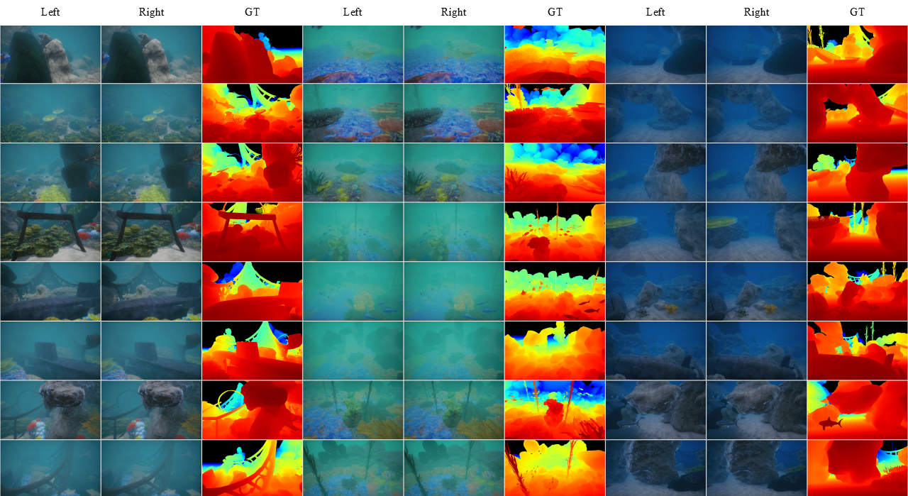
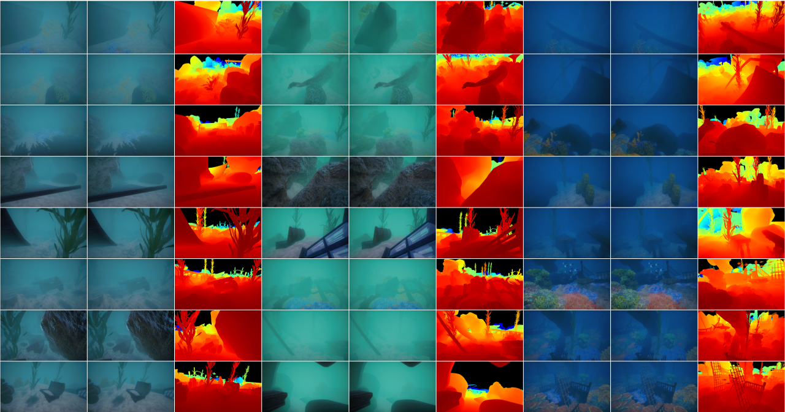

# TurbidStereo-Synth

A UE5-based synthetic underwater stereo matching dataset with multiple turbidity levels, water colors, and paired geometric/restoration supervision.

> **Associated paper:** *UWStereo-Diff: Physics-Guided Diffusion Stereo Matching for Underwater Degraded Scenes* (Applied Optics).

## Overview

TurbidStereo-Synth is a synthetic underwater stereo dataset generated with Unreal Engine 5. It provides:

- **~12,000 stereo pairs** across three turbidity levels (heavy / mid / clear) and three ambient-light hues
- **Paired clear reference images** (scatter-free) for physical restoration supervision
- **Dense depth maps and disparity labels**
- **Global ambient-light RGB labels**
- **Camera intrinsics and calibration files**
- **Train/test split** (test: 1,080 pairs from independent scenes)

## Repository Contents

| Path | Description |
|------|-------------|
| `scripts/` | UE5 Python scripts for dataset generation |
| `figures/` | Example visualizations from the dataset |

## Generation Scripts

The `scripts/` directory contains UE5 Python (Unreal Editor Python API) scripts used to generate the dataset:

- `stereocamera_uw.py` — builds the virtual binocular camera rig
- `put_assets.py` — places 3D assets into the underwater scenes
- `sequencer.py` / `SequencerBinding.py` — controls the level sequencer for data collection
- `cube_cam.py` / `cube_cam_json.py` — camera configuration and JSON-driven setup
- `binding.py` — asset binding utilities
- `try_json.py` — JSON configuration loader
- `config.json` — camera, lighting, and environment configuration

> Note: `unreal.py` (the Unreal Python API type stub) is not included as it is auto-generated by the Unreal Editor.

## Dataset Samples





## Citation

If you use TurbidStereo-Synth in your research, please cite:

```
@article{wu2025uwstereodiff,
  title={UWStereo-Diff: Physics-Guided Diffusion Stereo Matching for Underwater Degraded Scenes},
  author={Wu, Chenrui and Hou, Xinrui and Chu, Zhenzhong and Huang, Yao},
  journal={Applied Optics},
  year={2025}
}
```

## License

This repository is licensed under the MIT License.

## Contact

For questions or access to the full dataset, please contact the corresponding author.
